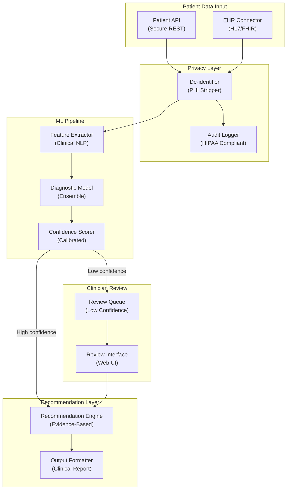

# Medical Diagnosis Assistant - System Architecture

**Infrastructure Components:**
- **EHR Connector**: FHIR/HL7 integration for structured patient record ingestion
- **De-identifier**: PHI removal pipeline (names, IDs, dates) to HIPAA Safe Harbor standard
- **Diagnostic Model**: Ensemble of clinical ML models (XGBoost + transformer) for differential diagnosis
- **Confidence Scorer**: Calibrated probability outputs; flags low-confidence cases for clinician review
- **Review Interface**: Clinician-facing UI for validating and overriding AI recommendations
- **Audit Logger**: Immutable log of all data accesses and AI decisions for HIPAA compliance
