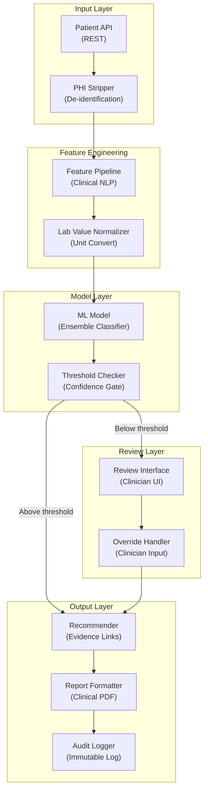

# Medical Diagnosis Assistant - Application Architecture

**Layer Breakdown:**
- **Input Layer**: Secure API with immediate PHI de-identification before any downstream processing
- **Feature Engineering**: Clinical NLP for symptom extraction, lab value normalization to standard units
- **Model Layer**: Ensemble classifier with calibrated confidence scores and threshold gating
- **Review Layer**: Clinician-facing review UI with override capability for low-confidence predictions
- **Output Layer**: Evidence-linked recommendations, clinical PDF reports, HIPAA audit trail
