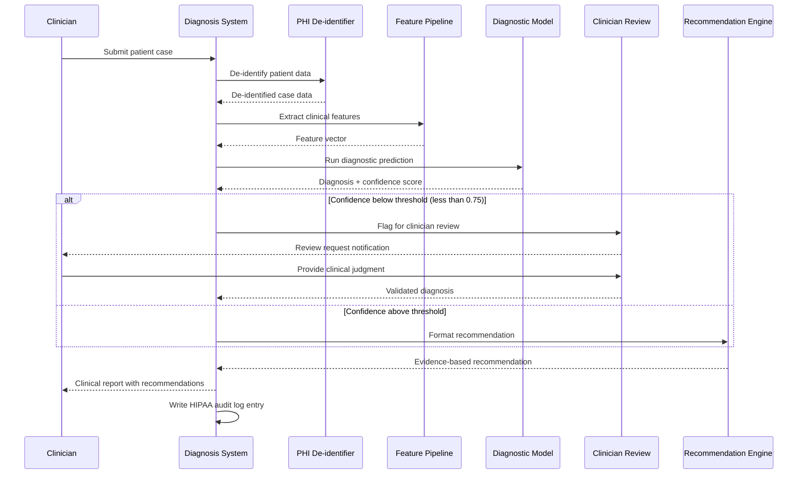

# Medical Diagnosis Assistant - Process Flow

**Key Decision Points:**
1. **PHI De-identification**: All patient data stripped of identifiers before ML processing
2. **Confidence Threshold**: Predictions below 0.75 confidence routed to clinician review queue
3. **Clinician Override**: Clinician can override AI diagnosis with their clinical judgment
4. **Audit Logging**: Every access and AI decision logged for HIPAA compliance

**Optimization Points:**
- PHI de-identification runs synchronously to ensure no raw PHI reaches ML components
- Feature extraction caches results for repeated case submissions (same patient, same visit)
- Confidence calibration uses Platt scaling to ensure confidence scores are meaningful probabilities
