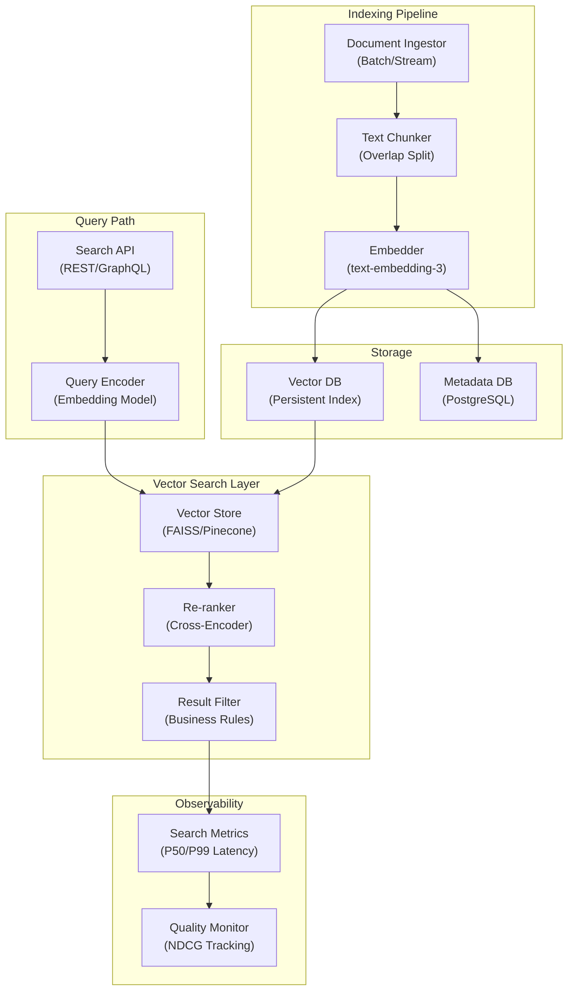

# AI Semantic Search Engine - System Architecture

**Infrastructure Components:**
- **Query Encoder**: Bi-encoder model converts query to dense vector for ANN search
- **Vector Store**: FAISS (local) or Pinecone (managed) for approximate nearest neighbor search
- **Re-ranker**: Cross-encoder model scores query-document pairs for precision improvement
- **Result Filter**: Business logic filters (access control, content policy, date recency)
- **Indexing Pipeline**: Async document ingestion with chunking, embedding, and index update
- **Quality Monitor**: NDCG@10 tracking to detect search quality regressions over time
