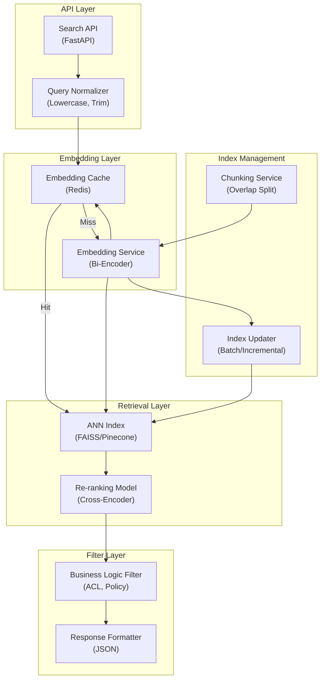

# AI Semantic Search Engine - Application Architecture

**Layer Breakdown:**
- **API Layer**: FastAPI with query normalization (lowercase, whitespace trim, spell correction)
- **Embedding Layer**: Bi-encoder embedding service with Redis cache for repeated queries
- **Retrieval Layer**: ANN search returns top-100 candidates, cross-encoder re-ranks to top-10
- **Filter Layer**: ACL enforcement, content policy filtering, final response formatting
- **Index Management**: Async chunking and embedding pipeline for document index updates
