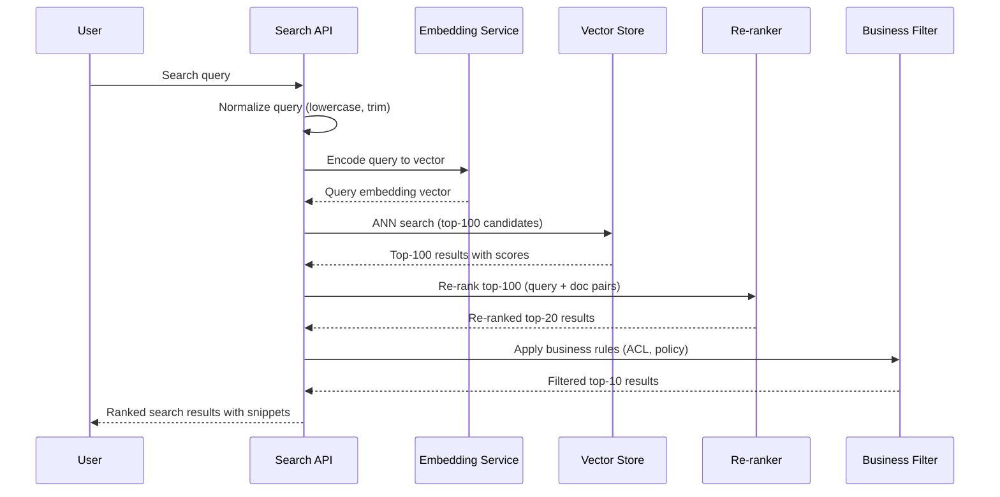

# AI Semantic Search Engine - Process Flow

**Key Decision Points:**
1. **Query Normalization**: Lowercase, trim, optionally spell-correct before embedding
2. **ANN Recall vs Precision**: Retrieve top-100 to ensure relevant docs in candidate set before re-ranking
3. **Re-ranking**: Cross-encoder improves precision from bi-encoder recall; adds ~50ms latency
4. **Business Filter**: Post-retrieval ACL enforcement to remove unauthorized results

**Optimization Points:**
- Embedding cache (Redis) for popular queries reduces P50 latency by 30-50%
- HNSW index (FAISS) gives sub-10ms ANN search for up to 100M vectors
- Async index updates so new documents appear in search within 5 minutes of ingestion
- Batch embedding during indexing (256+ chunks per batch) for 10x throughput improvement
