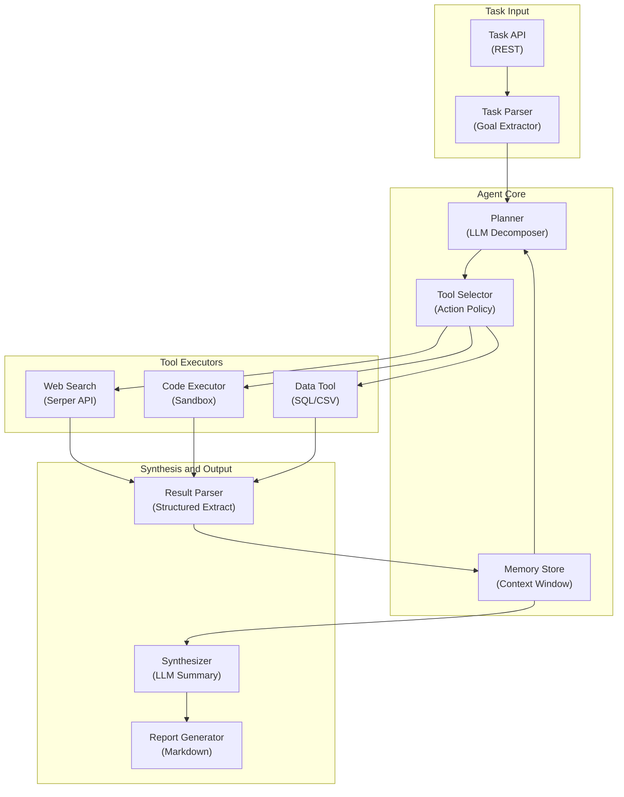

# Autonomous Research Agent - System Architecture

**Infrastructure Components:**
- **Planner**: LLM-based task decomposition into ordered sub-goals and tool calls
- **Tool Selector**: Policy-based selection of tools based on sub-goal type
- **Memory Store**: Rolling context window with summarization for long research tasks
- **Web Search**: Serper/Bing API for real-time web search with result parsing
- **Code Executor**: Sandboxed Python executor (E2B or Docker) for data analysis
- **Synthesizer**: LLM-based synthesis of gathered evidence into coherent report
