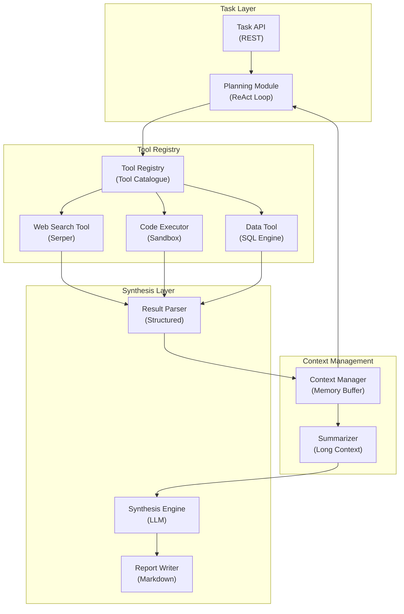

# Autonomous Research Agent - Application Architecture

**Layer Breakdown:**
- **Task Layer**: REST API with ReAct (Reason + Act) planning loop controlling tool invocation
- **Tool Registry**: Catalogue of available tools with descriptions for LLM-based selection
- **Context Management**: Rolling memory buffer with LLM summarization for long research sessions
- **Synthesis Layer**: Structured result parsing, LLM synthesis, final Markdown report generation
