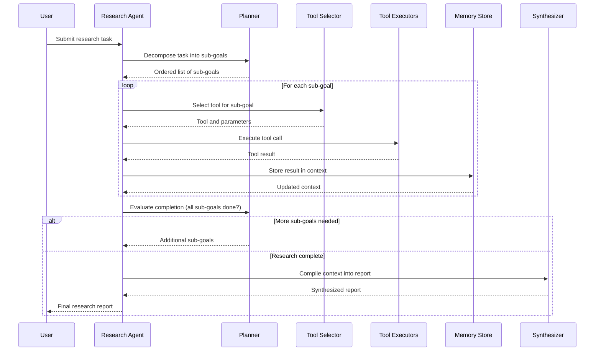

# Autonomous Research Agent - Process Flow

**Key Decision Points:**
1. **Task Decomposition**: Planner breaks research task into specific, tool-actionable sub-goals
2. **Tool Selection**: LLM selects best tool for each sub-goal (web, code, data)
3. **Memory Management**: Context window monitored; summarization triggered when nearing limit
4. **Completion Check**: Planner evaluates if gathered information sufficiently addresses task

**Optimization Points:**
- Parallel tool execution for independent sub-goals reduces total research time
- Memory summarization preserves key findings when context exceeds window limit
- Result caching prevents duplicate web searches within the same research session
