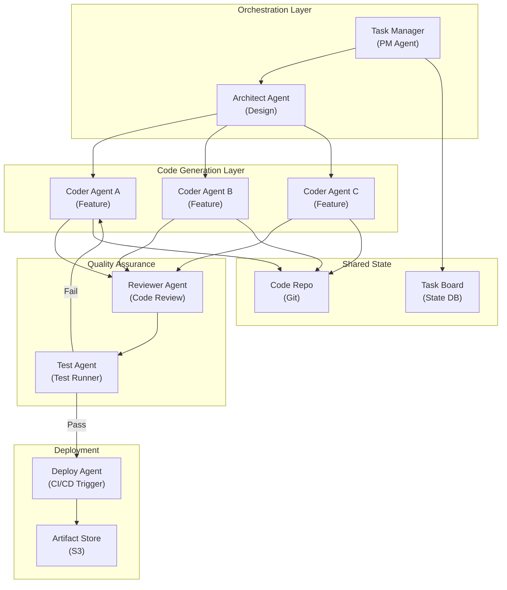

# Multi-Agent Software Development - System Architecture

**Infrastructure Components:**
- **Task Manager (PM Agent)**: Receives feature requests, creates tickets, delegates to Architect
- **Architect Agent**: Designs system structure, creates component specs, delegates to coders
- **Coder Agents (N parallel)**: Independent feature implementation workers
- **Reviewer Agent**: Code review with LLM-based quality checks (style, security, correctness)
- **Test Agent**: Runs test suite, reports failures back to coder agents for fix cycles
- **Deploy Agent**: Triggers CI/CD pipeline on test pass, manages artifact storage
