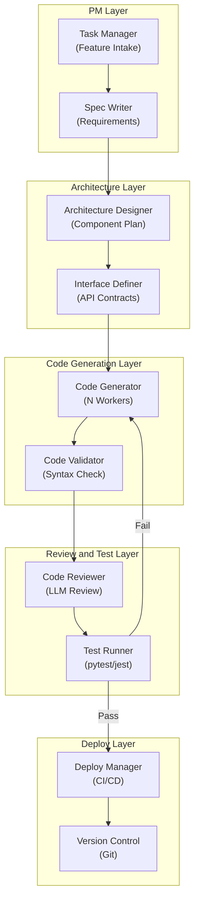

# Multi-Agent Software Development - Application Architecture

**Layer Breakdown:**
- **PM Layer**: Feature intake, requirement specification writing, task ticket creation
- **Architecture Layer**: Component design, API contract definition, implementation guidance
- **Code Generation**: Parallel code generation workers with syntax validation before review
- **Review and Test**: LLM-based code review followed by automated test execution
- **Deploy Layer**: Git version control, CI/CD pipeline trigger on test pass
