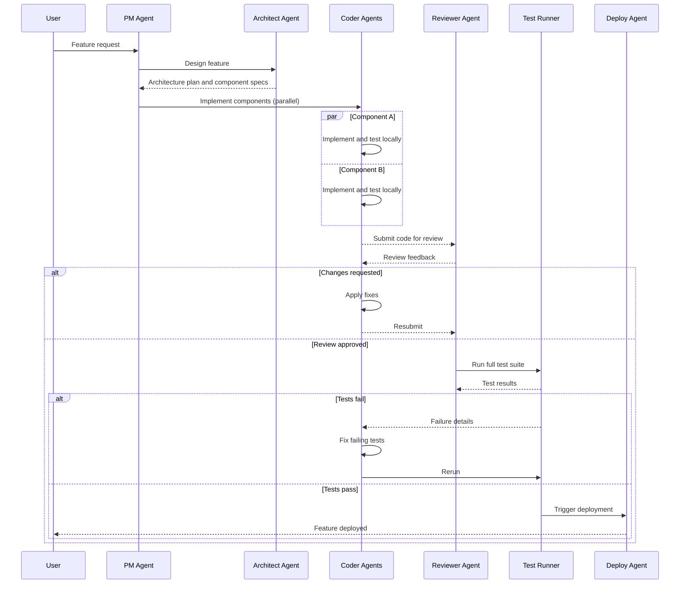

# Multi-Agent Software Development - Process Flow

**Key Decision Points:**
1. **Parallel Implementation**: Independent components coded concurrently to minimize total time
2. **Review Gate**: All code must pass LLM code review before test execution
3. **Test Failure Loop**: Test failures routed back to coder agents for targeted fixes
4. **Deployment Gate**: Deploy only triggered on clean test suite pass

**Optimization Points:**
- Component parallelism reduces wall-clock time proportional to number of independent components
- Interface contracts defined up-front allow parallel implementation without integration conflicts
- Review caching avoids re-reviewing unchanged code sections on fix iterations
