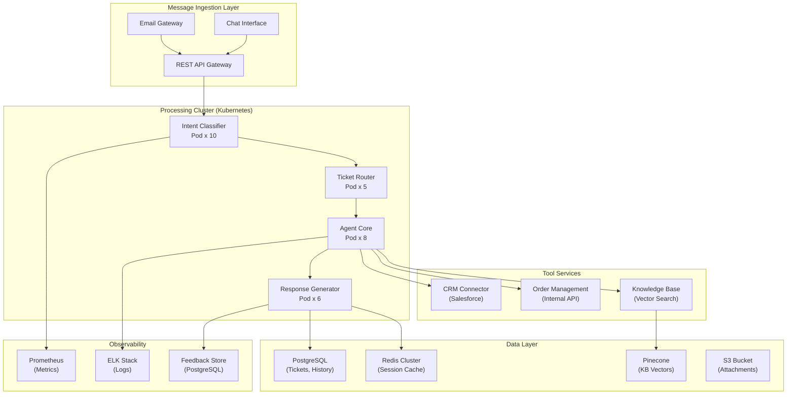

## System Architecture (Infrastructure and Deployment)

**Infrastructure Components:**
- **Compute**: Kubernetes cluster (auto-scaling 5-50 pods based on queue depth)
- **Storage**: PostgreSQL (tickets, conversation history), Redis (session state), Pinecone (KB embeddings), S3 (attachments)
- **Tool Integrations**: CRM (Salesforce), Order Management, Knowledge Base
- **Monitoring**: Prometheus (metrics), ELK (logs), Feedback Store (quality tracking)
- **Load Balancing**: AWS ALB with health checks and auto-scaling policies
