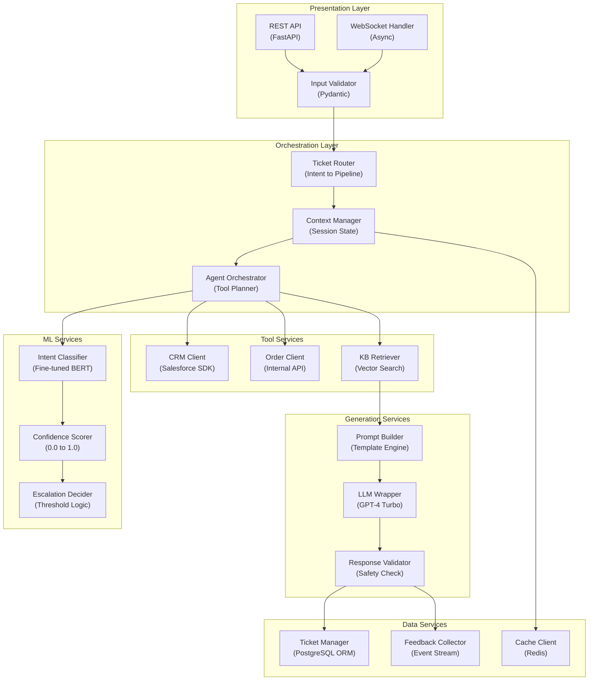

## Application Architecture (Components and Layers)

**Layer Breakdown:**
- **Presentation**: REST and WebSocket APIs with input validation
- **Orchestration**: Intent-based routing, agent tool planning, session context management
- **ML Services**: Intent classification, confidence scoring, escalation decisions
- **Tool Services**: CRM, order management, and knowledge base integrations
- **Generation Services**: Prompt construction, LLM invocation, safety validation
- **Data Services**: Ticket persistence, session cache, feedback collection
