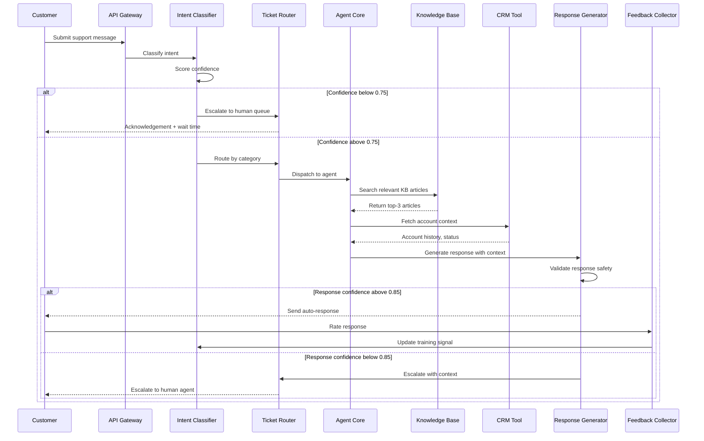

## Process Flow (Ticket to Resolution)

**Key Decision Points:**
1. **Confidence Check (0.75)**: Below threshold routes directly to human queue
2. **KB Search**: Retrieves top-3 articles before response generation
3. **CRM Lookup**: Fetches account context for personalized responses
4. **Response Gate (0.85)**: Auto-send only if generation confidence is high enough
5. **Feedback Loop**: User ratings flow back to retrain the classifier

**Error Paths:**
- Low intent confidence: immediate human escalation with ticket context
- Low response confidence: escalation with LLM reasoning attached
- Tool failure (CRM/KB): fallback to generic response with human review flag

**Optimization Points:**
- Cache frequent KB lookups (Redis, 1-hour TTL)
- Batch classify low-urgency tickets during off-peak hours
- Pre-warm CRM context for known high-value accounts
