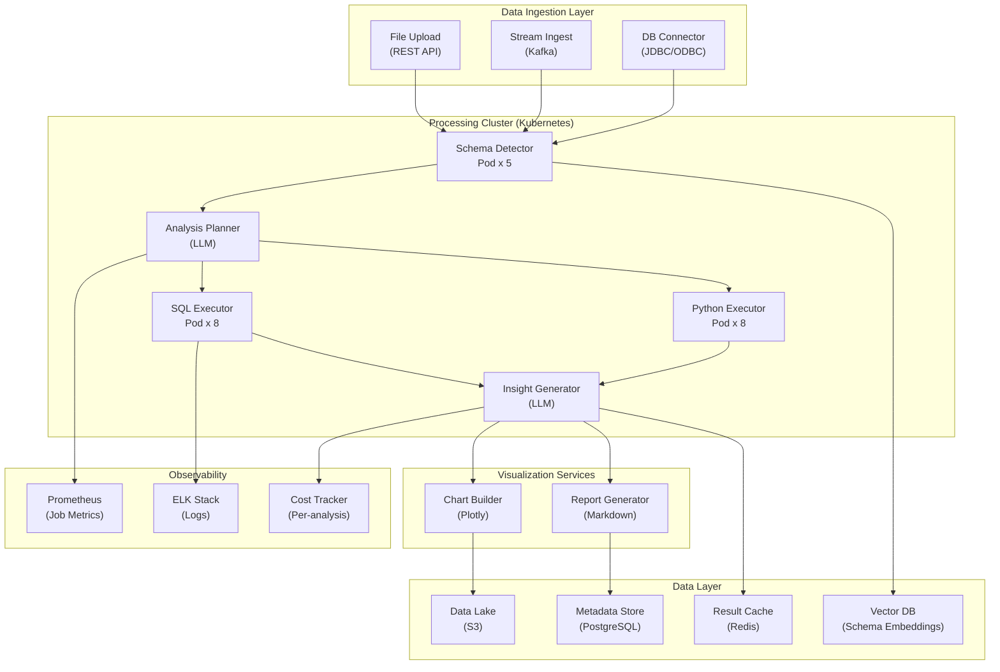

## System Architecture (Infrastructure and Deployment)

**Infrastructure Components:**
- **Compute**: Kubernetes cluster with autoscaling executor pods for SQL and Python workloads
- **Storage**: S3 (datasets, charts, reports), PostgreSQL (metadata, analysis history), Redis (result cache), VectorDB (schema embeddings)
- **Processing**: Schema-aware planners, SQL and Python executors, LLM insight generators
- **Monitoring**: Prometheus (job metrics), ELK (execution logs), per-analysis cost tracking
