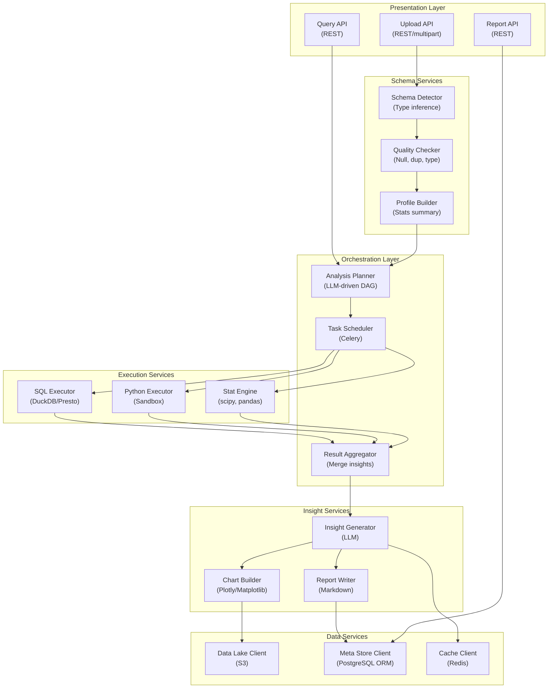

## Application Architecture (Components and Layers)

**Layer Breakdown:**
- **Presentation**: Upload, query, and report APIs
- **Orchestration**: LLM-driven analysis planning, task scheduling, result aggregation
- **Schema Services**: Type inference, data quality checks, statistical profiling
- **Execution Services**: SQL (DuckDB), sandboxed Python, statistical computation
- **Insight Services**: LLM insight generation, chart building, report writing
- **Data Services**: Data lake, metadata store, result cache
