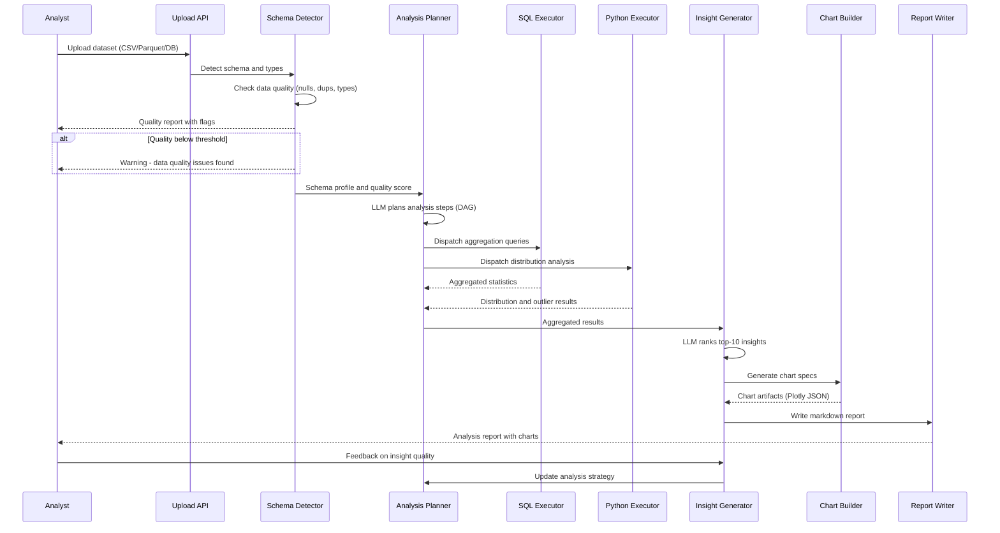

## Process Flow (Dataset to Insight Report)

**Key Decision Points:**
1. **Quality Gate**: Data quality flags shown before deep analysis begins
2. **LLM Planning**: Planner determines which SQL and Python tasks to dispatch in parallel
3. **Insight Ranking**: LLM ranks insights by business relevance (top-10 surfaced)
4. **Chart Selection**: Three chart types generated per key insight, analyst picks preferred view
5. **Feedback Loop**: Analyst feedback refines insight ranking model over time

**Error Paths:**
- File too large: stream in chunks, partition analysis
- SQL timeout: fall back to sampled analysis (10% sample with note)
- LLM insight failure: return raw statistics without narrative

**Optimization Points:**
- Cache schema profiles for repeated uploads of same dataset
- Run SQL and Python executors in parallel (DAG-scheduled)
- Batch chart generation for multi-column reports
