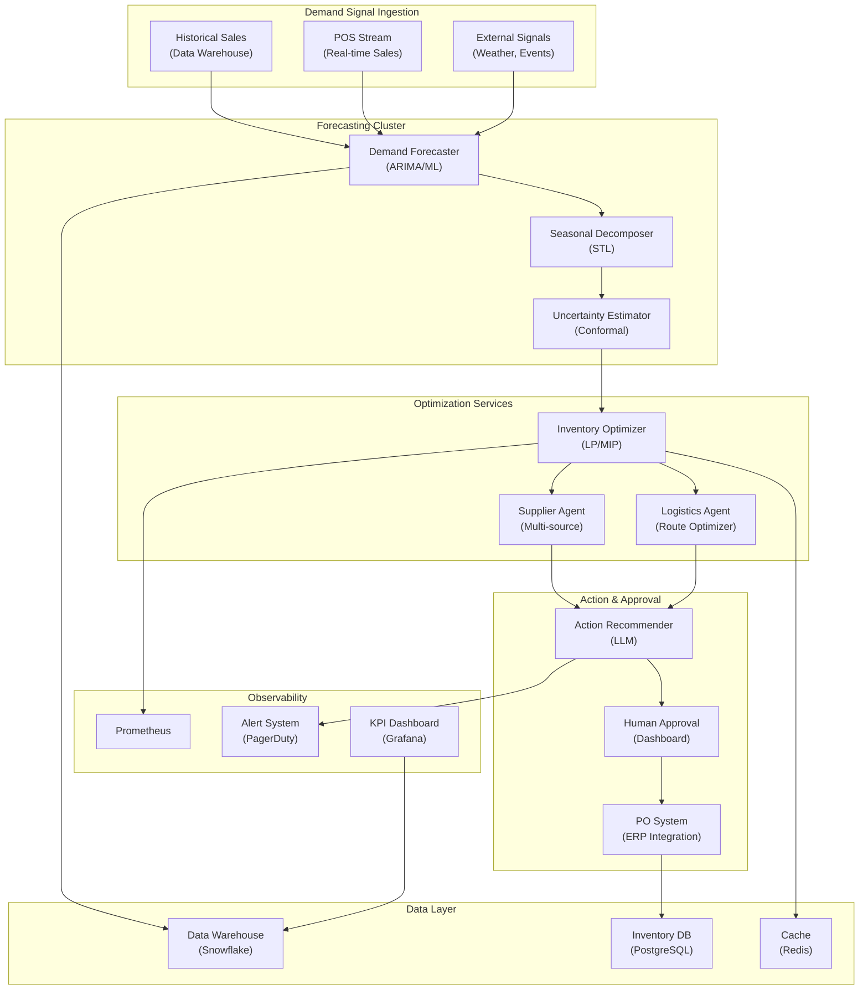

## System Architecture (Infrastructure and Deployment)

**Infrastructure Components:**
- **Compute**: Kubernetes cluster with forecasting and optimization pods
- **Storage**: Snowflake (data warehouse), PostgreSQL (inventory records), Redis (optimization cache)
- **ML**: ARIMA/ML demand forecasters, LP/MIP inventory optimizers, multi-source supplier agents
- **Integration**: ERP for purchase order submission, human approval dashboard
- **Monitoring**: Prometheus, PagerDuty alerts, Grafana KPI dashboards
