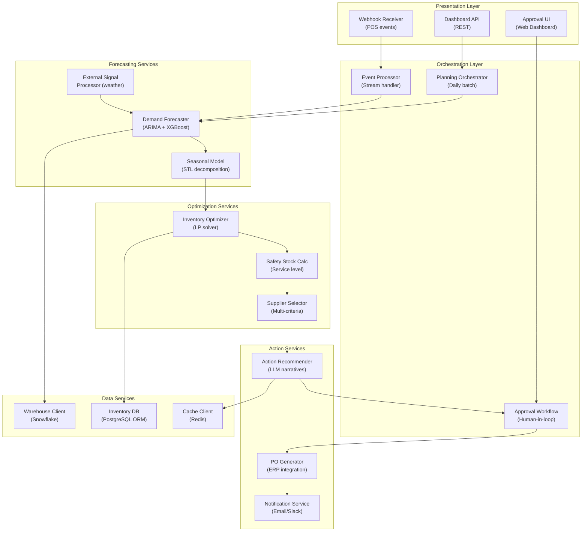

## Application Architecture (Components and Layers)

**Layer Breakdown:**
- **Presentation**: Dashboard API, POS webhook receiver, approval UI
- **Orchestration**: Daily batch planner, real-time event processor, human approval workflow
- **Forecasting Services**: ARIMA/ML demand forecasting, seasonal decomposition, external signals
- **Optimization Services**: LP-based inventory optimizer, safety stock calculator, multi-criteria supplier selection
- **Action Services**: PO generation, LLM-narrated recommendations, notifications
- **Data Services**: Snowflake warehouse, inventory database, optimization cache
