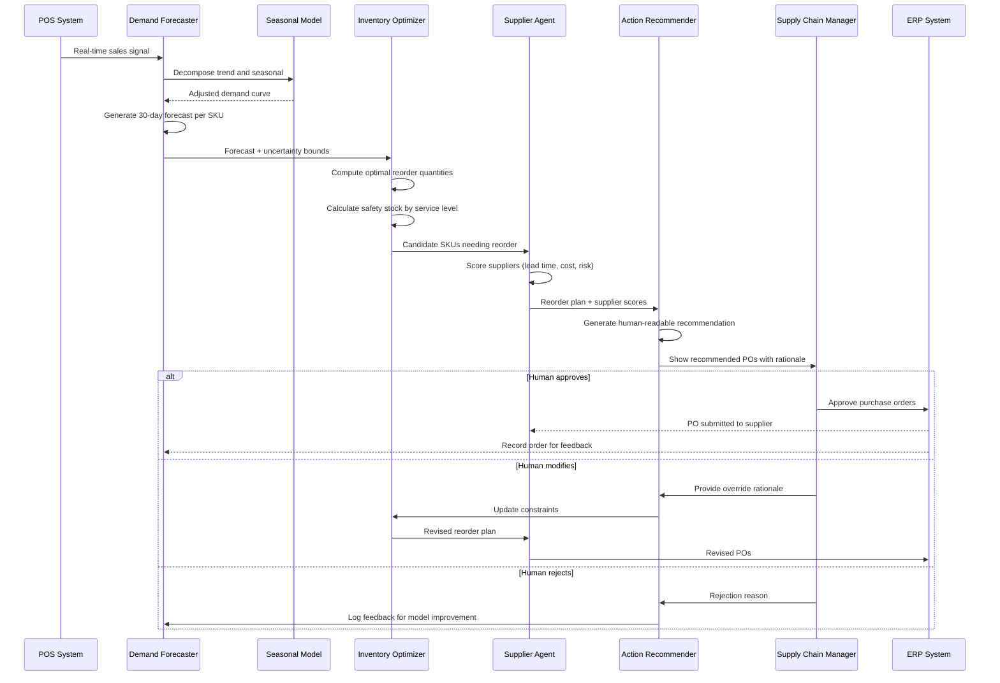

## Process Flow (Demand Signal to Purchase Order)

**Key Decision Points:**
1. **Seasonal Decomposition**: STL decomposition prevents over-ordering before off-season
2. **Uncertainty Bounds**: Safety stock formula uses forecast standard deviation
3. **Supplier Scoring**: Multi-criteria (lead time, cost, disruption risk) for resilience
4. **Human Approval Gate**: All POs above threshold require human sign-off
5. **Override Feedback**: Manager overrides feed back into the optimization model

**Error Paths:**
- Supplier disruption signal: escalate to dual-source recommendation
- Demand spike detected (3x normal): alert manager immediately, hold auto-order
- ERP submission failure: queue for retry, alert supply chain manager

**Optimization Points:**
- Cache daily optimization results per SKU (avoid redundant LP runs)
- Batch low-velocity SKUs into weekly optimization instead of daily
- Pre-compute seasonal adjustments for the next 90 days during off-hours
