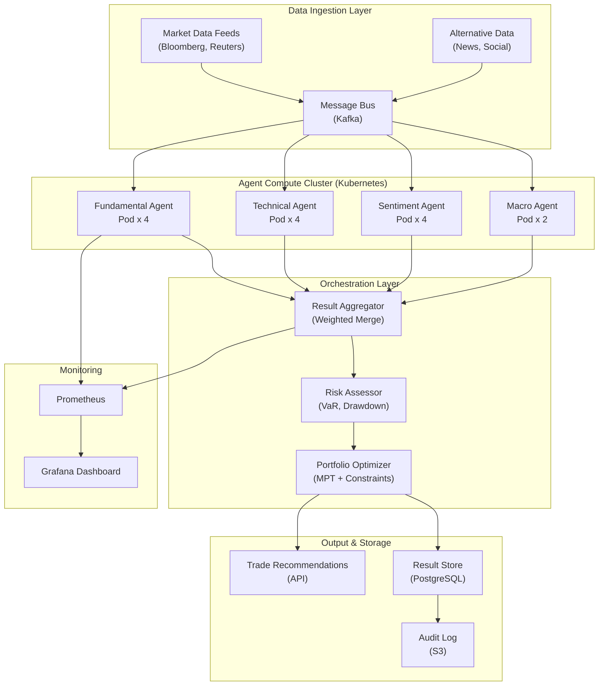

## System Architecture (Infrastructure & Deployment)

**Infrastructure Components:**
- **Data Ingestion**: Kafka message bus consuming Bloomberg, Reuters, and alternative data feeds
- **Agent Cluster**: Kubernetes-managed pods for Fundamental, Technical, Sentiment, and Macro agents
- **Orchestration**: Weighted aggregation, risk assessment (VaR), and portfolio optimization (MPT)
- **Storage**: PostgreSQL for results, S3 for immutable audit logs
- **Monitoring**: Prometheus metrics with Grafana dashboards for agent health and latency
