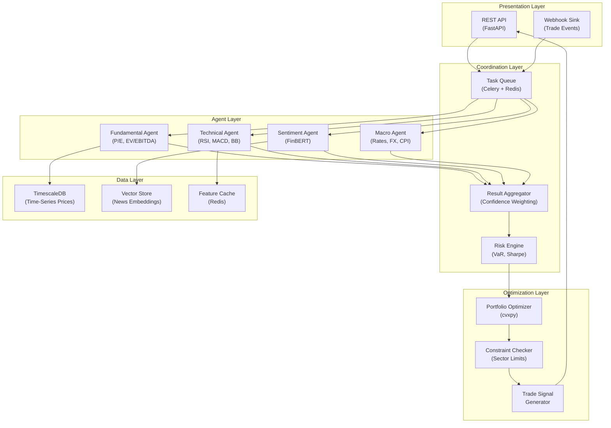

## Application Architecture (Components & Layers)

**Layer Breakdown:**
- **Presentation**: REST API for recommendation queries and webhook sink for real-time trade events
- **Agent Layer**: Specialized agents covering fundamental, technical, sentiment, and macro signals
- **Coordination**: Celery task queue dispatching to agents; confidence-weighted aggregation
- **Optimization**: cvxpy-based portfolio optimization with sector/position constraints
- **Data Layer**: TimescaleDB for price history, vector store for news, Redis for feature caching
