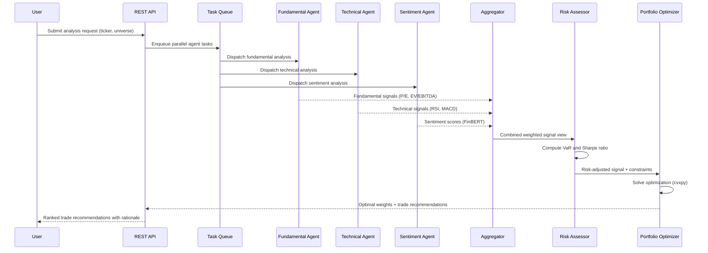

## Process Flow (Analysis Request to Trade Recommendation)

**Key Decision Points:**
1. **Parallel Dispatch**: All three agents run concurrently to minimize latency
2. **Confidence Weighting**: Aggregator weights agent signals by historical accuracy per asset class
3. **Risk Filtering**: Positions exceeding VaR or drawdown thresholds are reduced before optimization
4. **Constraint Enforcement**: Sector concentration and position size limits applied before output

**Error Paths:**
- Agent timeout (>5s) - use last cached signal with staleness flag
- Missing data for a ticker - skip that agent, note in rationale
- Optimization infeasible - relax constraints incrementally until feasible

**Optimization Points:**
- Feature caching avoids redundant indicator computation across agent runs
- Batch ticker processing amortizes model loading overhead
- Async agent dispatch with shared result collector reduces wall-clock latency
