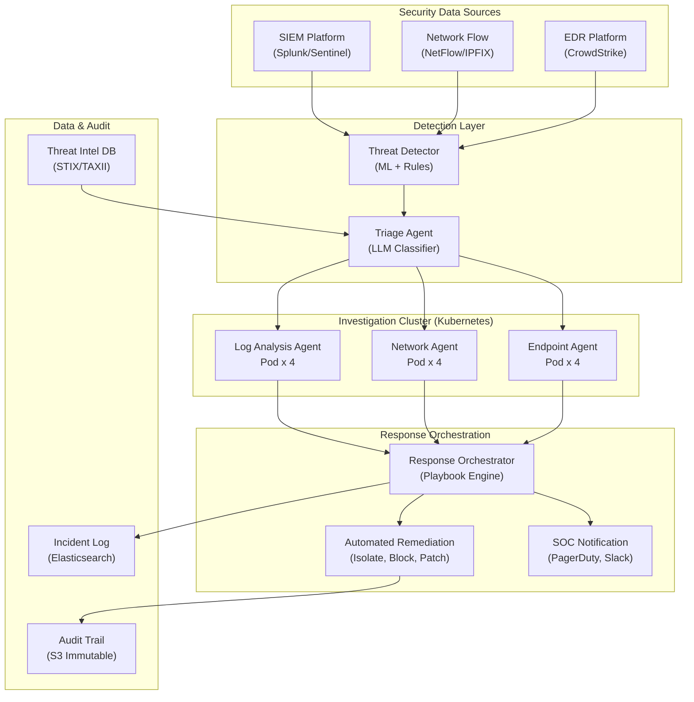

## System Architecture (Infrastructure & Deployment)

**Infrastructure Components:**
- **Data Sources**: SIEM (Splunk/Sentinel), network flow collectors, EDR telemetry
- **Detection**: ML + rule-based threat detector feeding an LLM triage classifier
- **Investigation Cluster**: Kubernetes pods for log, network, and endpoint agents running in parallel
- **Response**: Playbook-driven orchestrator executing automated remediation and SOC notifications
- **Data**: STIX/TAXII threat intel, Elasticsearch incident log, immutable S3 audit trail
