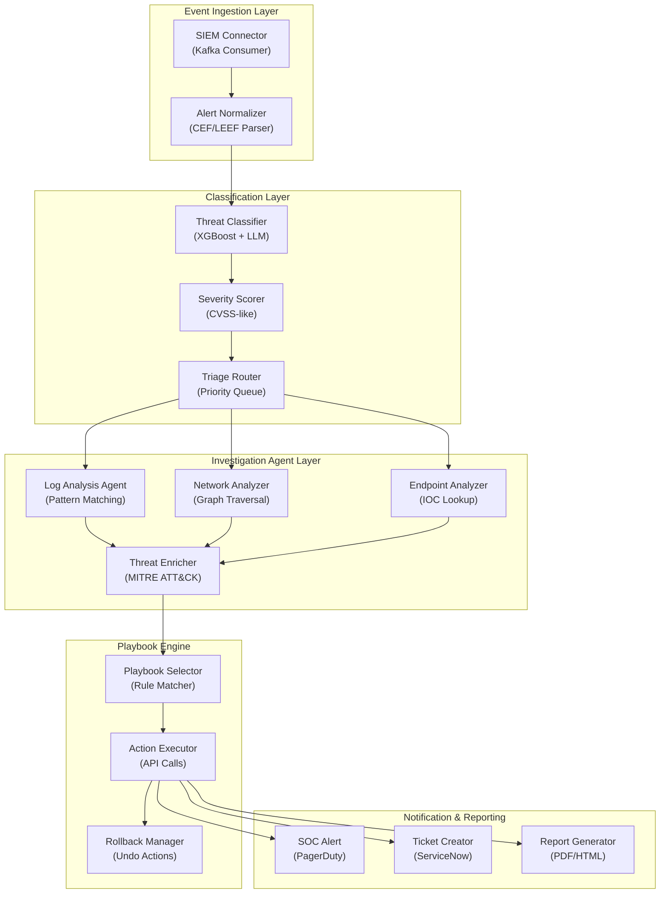

## Application Architecture (Components & Layers)

**Layer Breakdown:**
- **Ingestion**: Kafka consumer normalizing heterogeneous SIEM formats (CEF, LEEF)
- **Classification**: XGBoost + LLM hybrid classifier with CVSS-like severity scoring
- **Agent Layer**: Parallel investigation agents enriched with MITRE ATT&CK framework
- **Playbook Engine**: Rule-based playbook selection driving automated API-based actions with rollback
- **Notification**: SOC alerting, ticket creation, and incident reporting
