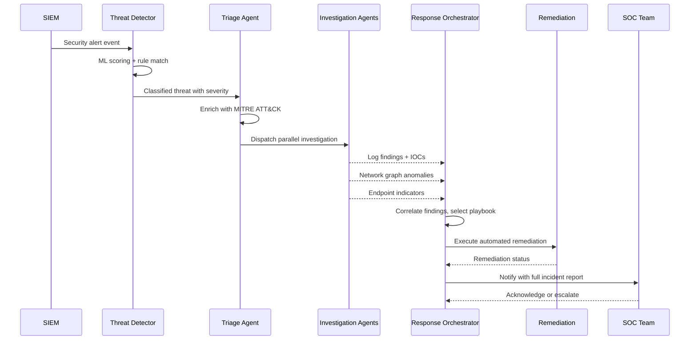

## Process Flow (Alert to Remediation)

**Key Decision Points:**
1. **Severity Threshold**: Alerts below severity 3 auto-close; above 7 page SOC immediately
2. **Parallel Investigation**: Log, network, and endpoint agents run concurrently to reduce MTTR
3. **Playbook Selection**: Matched against attack pattern (MITRE tactic) and asset criticality
4. **Auto-Remediation Gate**: High-confidence detections (>0.9) trigger automated actions; others require SOC approval

**Error Paths:**
- Agent investigation timeout - proceed with available findings, flag incomplete
- Remediation action failure - trigger rollback, escalate to SOC
- Unknown attack pattern - route to SOC with enriched context for manual triage

**Optimization Points:**
- IOC caching avoids repeated threat intel API calls for known indicators
- Playbook pre-compilation reduces response latency for common attack patterns
- Async SOC notification does not block remediation execution
