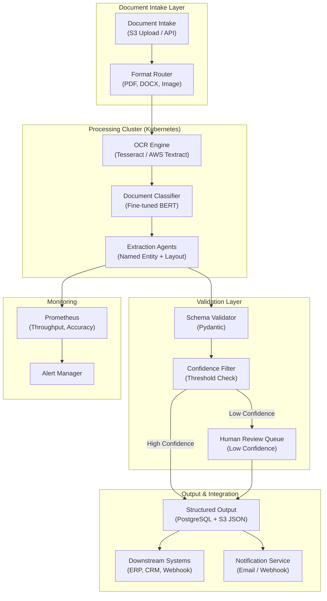

## System Architecture (Infrastructure & Deployment)

**Infrastructure Components:**
- **Intake**: S3 upload trigger or REST API accepting PDF, DOCX, and image formats
- **Processing**: Kubernetes cluster running OCR, BERT-based classifier, and extraction agents
- **Validation**: Pydantic schema validation with confidence-based human review queue
- **Output**: Structured JSON stored in PostgreSQL and S3, forwarded to downstream systems
- **Monitoring**: Prometheus tracking throughput, OCR accuracy, and extraction confidence
