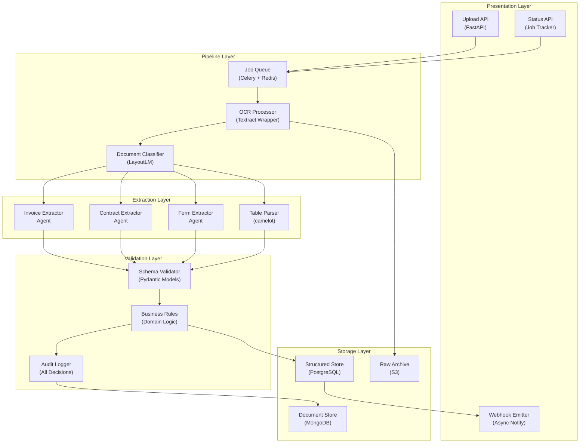

## Application Architecture (Components & Layers)

**Layer Breakdown:**
- **Presentation**: REST API for uploads, status polling, and async webhook notifications
- **Pipeline**: Celery job queue driving OCR and LayoutLM-based document classification
- **Extraction**: Specialized agents per document type (invoice, contract, form) plus table parser
- **Validation**: Pydantic schema + domain business rules with full decision audit logging
- **Storage**: MongoDB for document metadata, PostgreSQL for structured fields, S3 for raw archives
