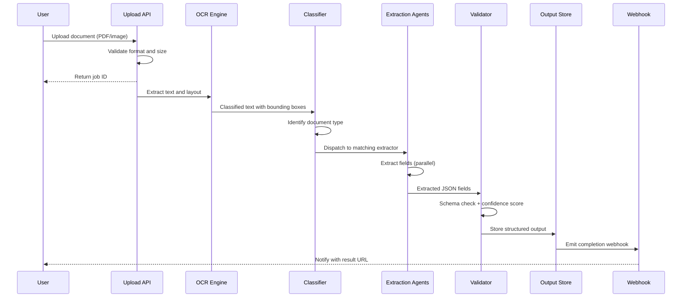

## Process Flow (Document Upload to Structured Output)

**Key Decision Points:**
1. **Format Validation**: Reject unsupported formats early to save processing cost
2. **Document Classification**: LayoutLM routes to the correct specialized extractor
3. **Confidence Threshold**: Fields below 0.7 confidence flagged for human review
4. **Schema Enforcement**: Output rejected if required fields missing; human queue triggered

**Error Paths:**
- OCR failure - retry with fallback engine (Tesseract), flag low-quality scan
- Classification below threshold - route to generic extractor + human review
- Schema validation failure - store raw extraction with error flag, notify user

**Optimization Points:**
- Async job processing prevents upload API from blocking on long OCR tasks
- Document type caching skips re-classification for recurring templates
- Batch OCR calls amortize Textract API overhead for multi-page documents
