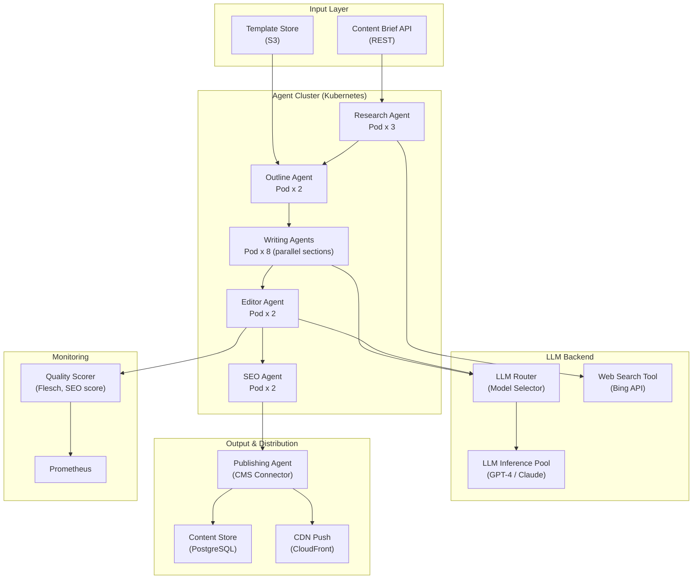

## System Architecture (Infrastructure & Deployment)

**Infrastructure Components:**
- **Input**: REST API accepting content briefs, S3 template store for style guides
- **Agent Cluster**: Kubernetes pods for each pipeline stage; Writing Agents parallelized by section
- **LLM Backend**: Model router selecting GPT-4 or Claude based on task; Bing API for web research
- **Output**: CMS-connected publishing agent pushing to PostgreSQL and CloudFront CDN
- **Quality**: Readability and SEO scoring tracked via Prometheus
