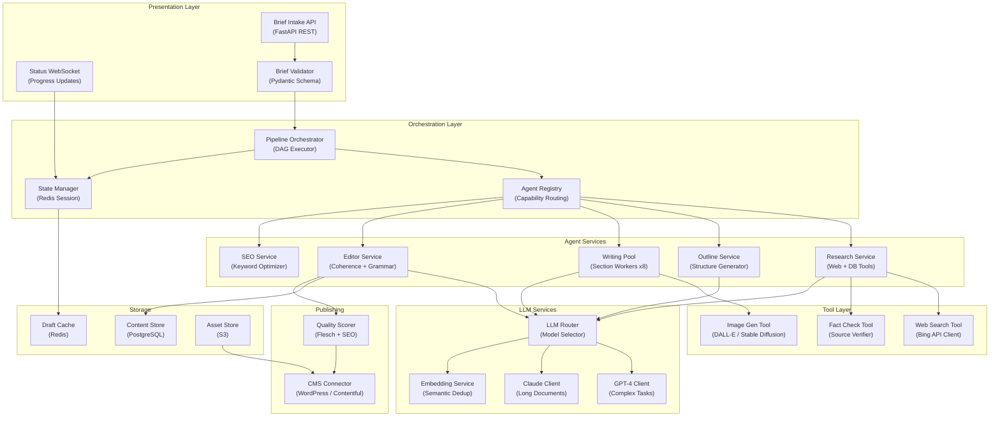

## Application Architecture (Components & Layers)

**Layer Breakdown:**
- **Presentation**: REST API for brief intake, WebSocket for real-time pipeline status
- **Orchestration**: DAG-based pipeline with agent registry for capability routing
- **Agent Services**: Specialized agents per content creation stage
- **Tool Layer**: External tools (web search, fact check, image generation)
- **LLM Services**: Model routing between GPT-4 and Claude by task type
- **Storage**: PostgreSQL for content, Redis for drafts, S3 for media assets
- **Publishing**: Quality scoring before CMS connector push
