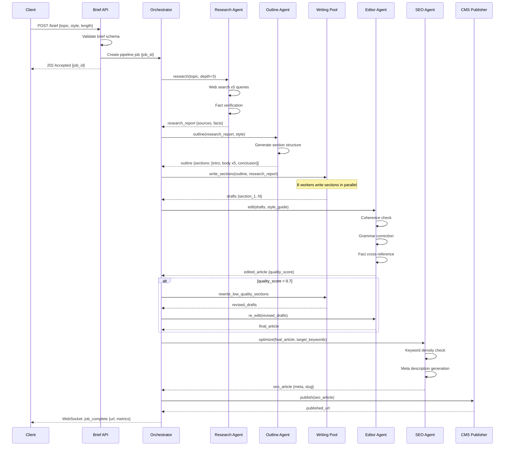

## Process Flow (Request Lifecycle)

**Flow Highlights:**
- Brief validation enforces schema before pipeline starts
- Research runs first to ground all subsequent generation
- Writing Pool parallelizes section drafting for 8x throughput
- Quality gate triggers selective rewrite rather than full regeneration
- SEO optimization is the final step before CMS push
- Client receives async updates via WebSocket throughout the pipeline
