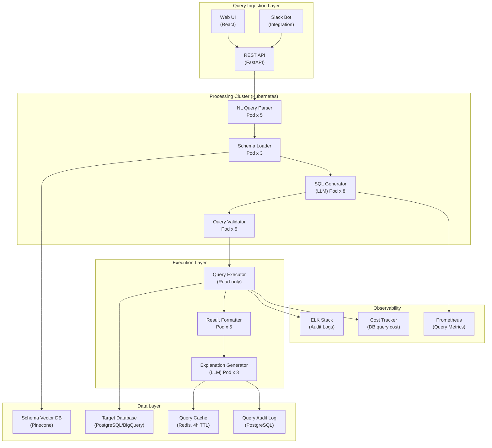

## System Architecture (Infrastructure and Deployment)

**Infrastructure Components:**
- **Compute**: Kubernetes cluster with separate pods for NL parsing, SQL generation, validation, execution
- **Storage**: PostgreSQL/BigQuery (target DB, read-only access), Pinecone (schema embeddings), Redis (query cache), audit log DB
- **Security**: Read-only query executor, RBAC per user role, access control layer
- **Monitoring**: Prometheus (query metrics), ELK (audit logs), per-query cost tracking
