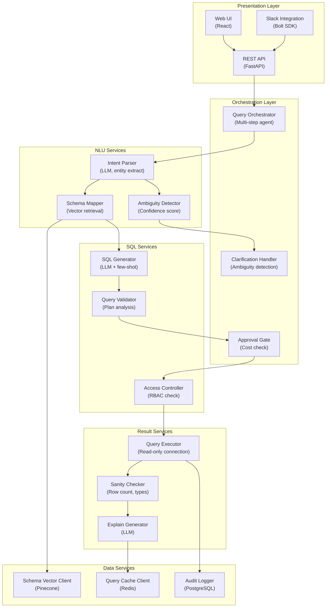

## Application Architecture (Components and Layers)

**Layer Breakdown:**
- **Presentation**: Web UI, REST API, Slack integration for natural language queries
- **Orchestration**: Multi-step query agent, clarification handling, cost approval gate
- **NLU Services**: LLM-based intent parsing, ambiguity detection, schema vector mapping
- **SQL Services**: LLM SQL generation, query plan validation, RBAC access control
- **Result Services**: Read-only query execution, sanity checks, LLM explanations
- **Data Services**: Schema vector store, query result cache, audit log
