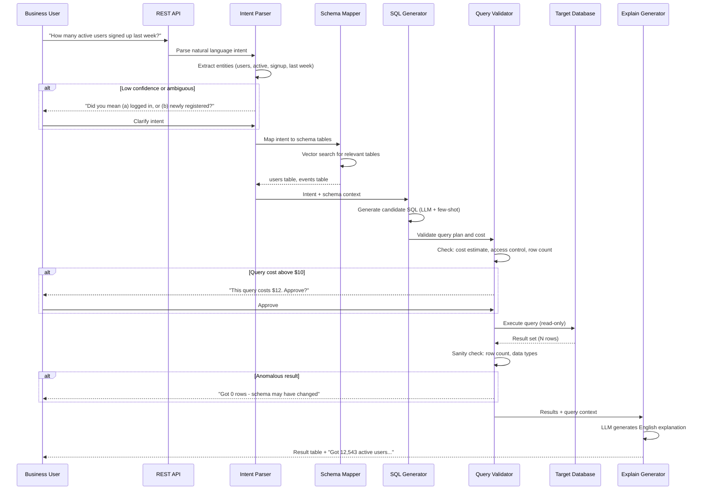

## Process Flow (Natural Language to Query Result)

**Key Decision Points:**
1. **Ambiguity Detection**: Clarification question if confidence below 0.85
2. **Schema Retrieval**: Vector search limits LLM context to top-5 relevant tables
3. **Cost Gate**: Queries estimated above $10 require explicit user approval
4. **Access Control**: RBAC blocks restricted tables before execution
5. **Sanity Check**: Row count and type validation before returning results

**Error Paths:**
- No schema match: ask user to rephrase or show available data domains
- Query execution timeout: suggest smaller time window or aggregation
- Access denied: show which role is required, suggest contacting data team

**Optimization Points:**
- Cache results for identical queries (Redis, 4-hour TTL)
- Pre-embed schema summaries for fast vector retrieval
- Bookmark frequent queries as saved reports for one-click re-run
