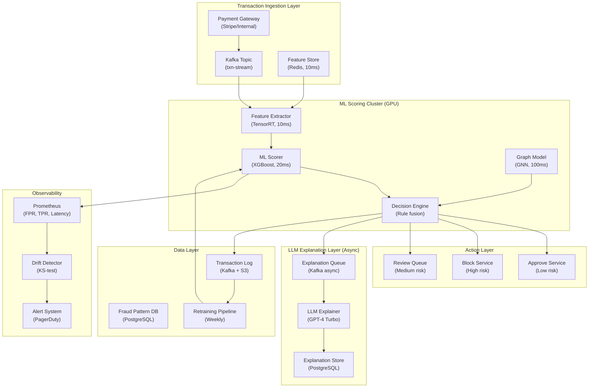

## System Architecture (Infrastructure and Deployment)

**Infrastructure Components:**
- **Compute**: GPU cluster for XGBoost and GNN scoring (8x A100), async LLM explanation workers
- **Storage**: Kafka (transaction stream), Redis (feature store, 10ms lookup), PostgreSQL (fraud patterns, explanations)
- **Latency Budget**: Feature extraction 10ms + ML scoring 20ms + decision 10ms = 40ms critical path
- **Monitoring**: Real-time FPR/TPR tracking, KS-test drift detection, weekly retraining triggers
