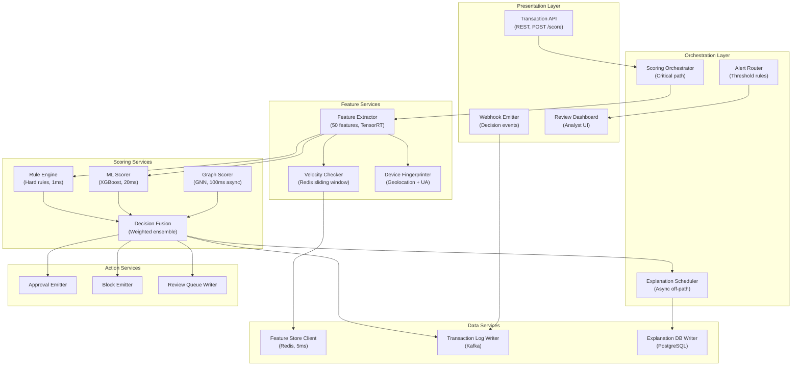

## Application Architecture (Components and Layers)

**Layer Breakdown:**
- **Presentation**: Transaction scoring API, webhook decision emitter, analyst review dashboard
- **Orchestration**: Critical-path scoring orchestrator, async explanation scheduler, alert router
- **Feature Services**: TensorRT feature extraction, Redis velocity windows, device fingerprinting
- **Scoring Services**: Rule engine (1ms), XGBoost ML scorer (20ms), GNN graph scorer (100ms async), weighted fusion
- **Action Services**: Approval, block, and review queue emitters
- **Data Services**: Redis feature store, Kafka transaction log, PostgreSQL explanation store
