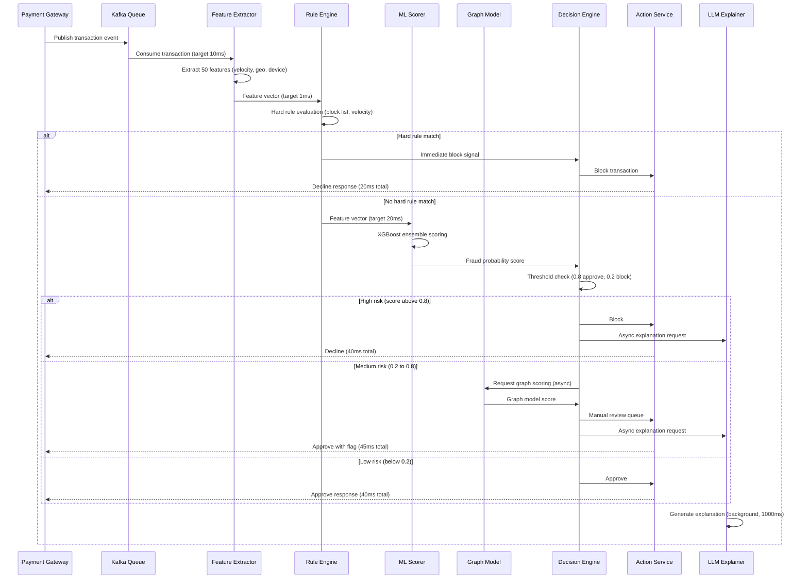

## Process Flow (Transaction to Decision)

**Key Decision Points:**
1. **Hard Rules (1ms)**: Block list, impossible velocity (two cities in 30 min) - no ML needed
2. **ML Threshold (20ms)**: XGBoost score above 0.8 = auto-block, below 0.2 = auto-approve
3. **Medium Risk Zone**: Graph model adds accuracy for borderline cases (async, non-blocking)
4. **LLM Explanation**: Always async - never on the critical path to avoid latency impact
5. **SLA Budget**: 40ms total for approve/block, explanation delivered asynchronously

**Error Paths:**
- Feature extraction timeout: fall back to rule-based decision only
- ML model unavailable: fall back to conservative rules (approve only known users)
- Kafka lag: alert ops team, scale consumer group

**Optimization Points:**
- Pre-compute user velocity windows in Redis (sliding window counter)
- Cache device fingerprints per user (avoid recomputation)
- Batch LLM explanations during low-traffic periods
