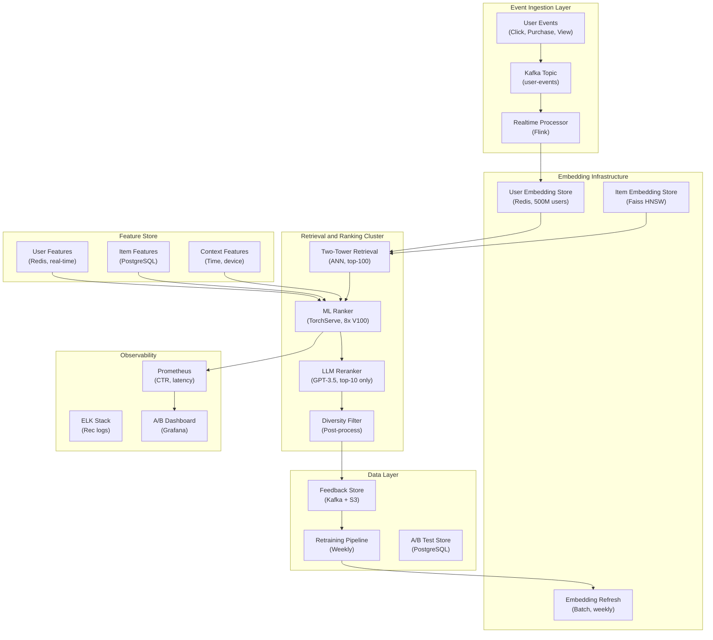

## System Architecture (Infrastructure and Deployment)

**Infrastructure Components:**
- **Compute**: GPU cluster (8x V100) for ML ranker, async LLM reranker workers
- **Storage**: Redis (user embeddings, 500M users), Faiss (item embeddings, HNSW index), PostgreSQL (item features, A/B results)
- **Pipeline**: Kafka for event streaming, Flink for real-time processing, weekly batch retraining
- **Monitoring**: Real-time CTR tracking, A/B test dashboards, embedding staleness alerts
