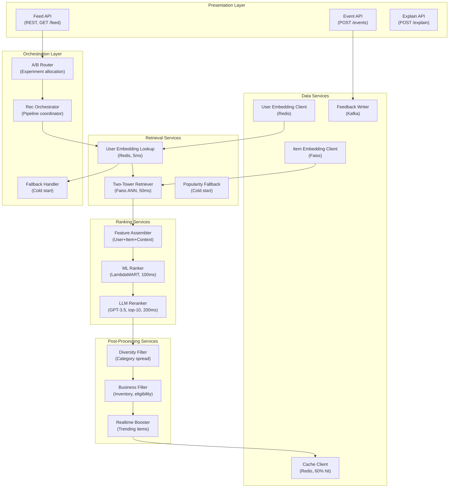

## Application Architecture (Components and Layers)

**Layer Breakdown:**
- **Presentation**: Feed, event ingestion, and explanation APIs
- **Orchestration**: Pipeline coordination, cold-start fallback, A/B experiment routing
- **Retrieval Services**: Redis user embedding lookup (5ms), Faiss ANN retrieval (50ms), popularity fallback
- **Ranking Services**: Feature assembly, LambdaMART ML ranker (100ms), selective LLM reranker (top-10 only)
- **Post-Processing**: Diversity enforcement, business eligibility filter, trending item boost
- **Data Services**: User/item embedding stores, Kafka feedback writer, result cache
