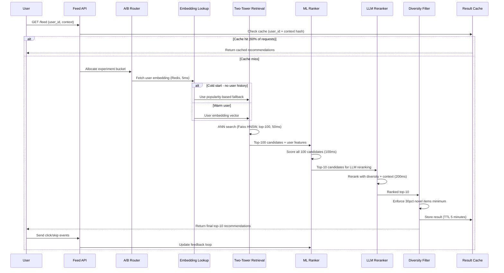

## Process Flow (User Request to Personalized Feed)

**Key Decision Points:**
1. **Cache Check**: 60% hit rate avoids full pipeline for common user/context pairs
2. **Cold Start Fallback**: New users without embeddings receive popularity-based recommendations
3. **Two-Stage Ranking**: Retrieval narrows from full catalog to 100, ranker narrows to 10
4. **LLM Selectivity**: Only reranks the final top-10, not all 100 candidates
5. **Diversity Enforcement**: At least 30% novel or diverse items injected to prevent filter bubbles

**Error Paths:**
- LLM reranker timeout: fall back to ML ranker output directly
- Faiss index unavailable: fall back to popularity + content-based retrieval
- Embedding stale (older than 7 days): serve stale with diversity boosted

**Optimization Points:**
- Cache at user-context granularity (device type, time-of-day bucket)
- Parallelize user embedding lookup and item embedding prefetch
- Pre-compute trending item boosts once per hour, not per request
