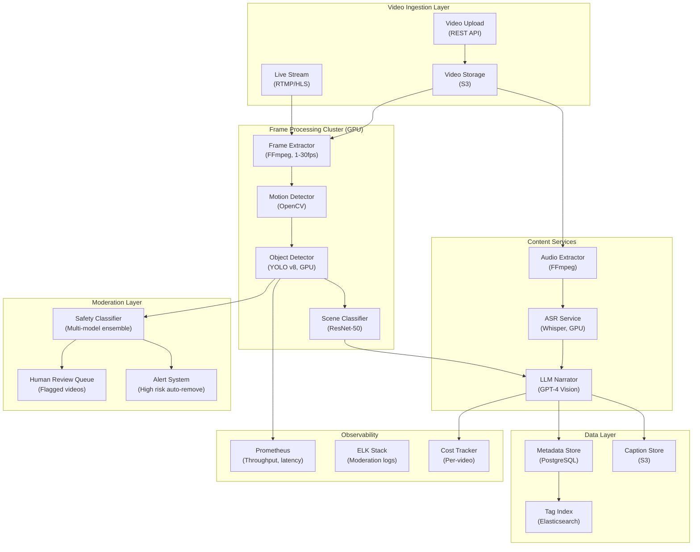

## System Architecture (Infrastructure and Deployment)

**Infrastructure Components:**
- **Compute**: GPU cluster for YOLO v8 object detection, ResNet scene classification, Whisper ASR
- **Storage**: S3 (videos, captions), PostgreSQL (metadata), Elasticsearch (tag index)
- **Moderation**: Multi-model ensemble for safety classification, human review queue, auto-remove for high-confidence violations
- **Cost Optimization**: Adaptive sampling (1fps baseline, scale up on motion detection)
