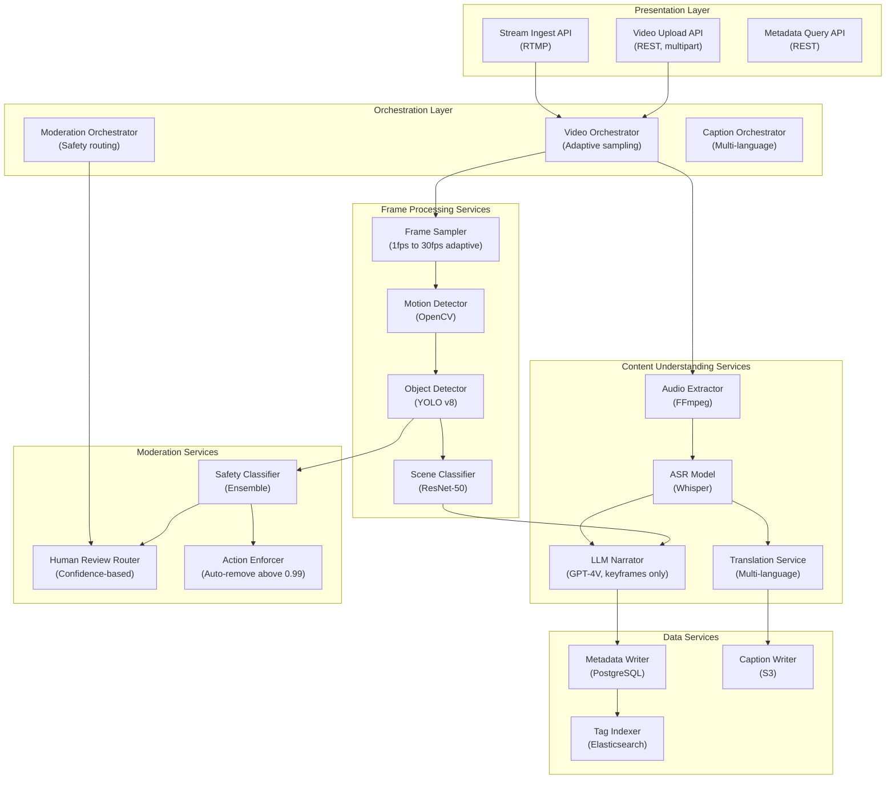

## Application Architecture (Components and Layers)

**Layer Breakdown:**
- **Presentation**: Video upload, live stream ingest, metadata query APIs
- **Orchestration**: Adaptive sampling coordinator, safety routing, multi-language caption pipeline
- **Frame Services**: Adaptive sampler (1-30fps), motion detection, YOLO object detection, scene classification
- **Content Services**: FFmpeg audio extraction, Whisper ASR, multi-language translation, selective LLM narration
- **Moderation Services**: Multi-model ensemble, confidence-based human routing, auto-enforcement
- **Data Services**: Metadata persistence, caption storage, Elasticsearch tag index
