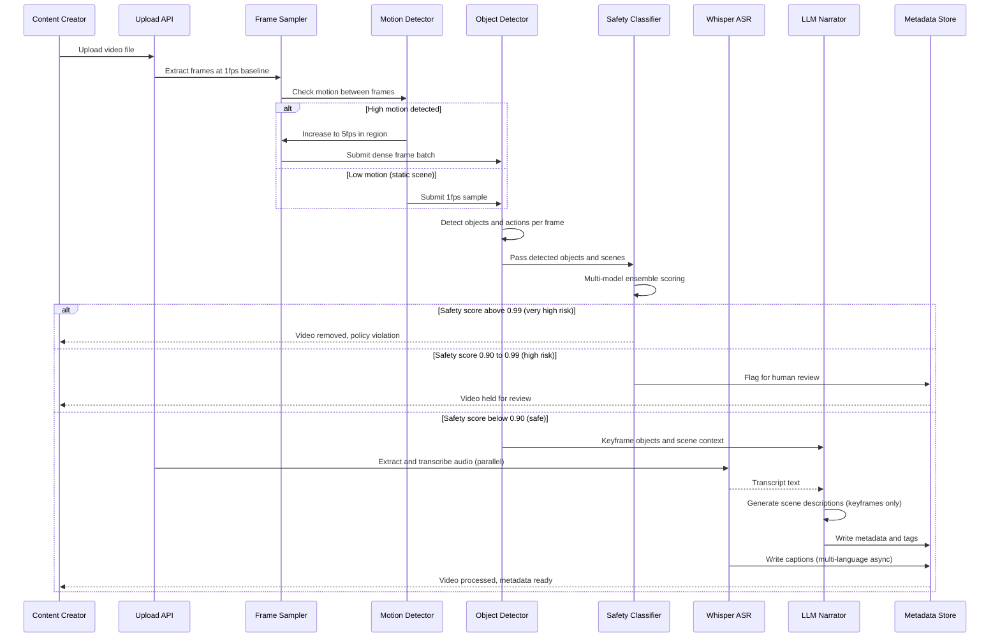

## Process Flow (Video Upload to Metadata and Captions)

**Key Decision Points:**
1. **Adaptive Sampling**: Motion detector upgrades from 1fps to 5fps on activity bursts
2. **Safety Triage**: Three tiers (auto-remove above 0.99, human review 0.90-0.99, allow below 0.90)
3. **LLM Selectivity**: Narrator only processes scene-change keyframes, not every frame
4. **Parallel Audio**: ASR runs concurrently with frame processing to avoid sequential latency
5. **Multi-language Captions**: Generated asynchronously after primary English captions complete

**Error Paths:**
- GPU memory exceeded: reduce frame rate, drop to 1fps for remainder
- ASR failure: deliver video without captions, retry async
- LLM narration timeout: deliver basic object tags without descriptive narration

**Optimization Points:**
- Skip narration for static scenes (no scene change in last 30 seconds)
- Cache common object vocabularies per video category
- Batch translate captions to top-5 languages off-peak
