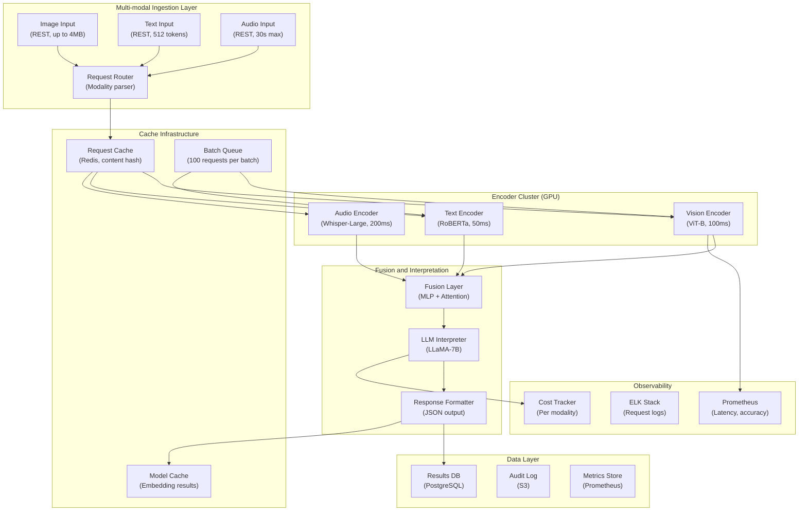

## System Architecture (Infrastructure and Deployment)

**Infrastructure Components:**
- **Compute**: Parallel GPU workers for vision (ViT-B), text (RoBERTa), audio (Whisper-Large) encoding
- **Fusion**: MLP + attention-based fusion layer, LLaMA-7B for interpretation
- **Cost**: ~$0.003/request unified vs $0.01 sequential API calls
- **Optimization**: Request dedup via content hash cache, batch processing queue (100 requests), embedding cache for repeated inputs
