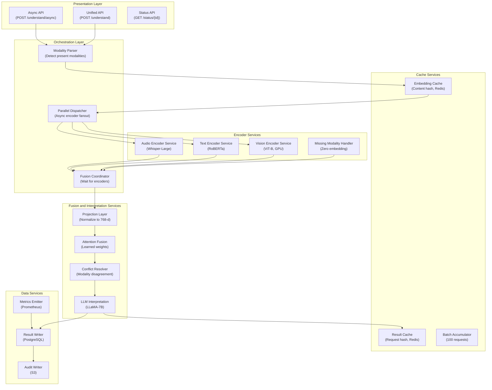

## Application Architecture (Components and Layers)

**Layer Breakdown:**
- **Presentation**: Synchronous, async, and status-check APIs for flexible latency handling
- **Orchestration**: Modality detection, parallel encoder dispatch, fusion coordination
- **Encoder Services**: Independent GPU-backed services per modality with graceful missing-modality handling
- **Fusion Services**: Dimension projection, attention-based fusion, LLM interpretation, conflict resolution
- **Cache Services**: Embedding-level and request-level caches, batch accumulator for cost efficiency
- **Data Services**: Result persistence, audit log, metrics emission
