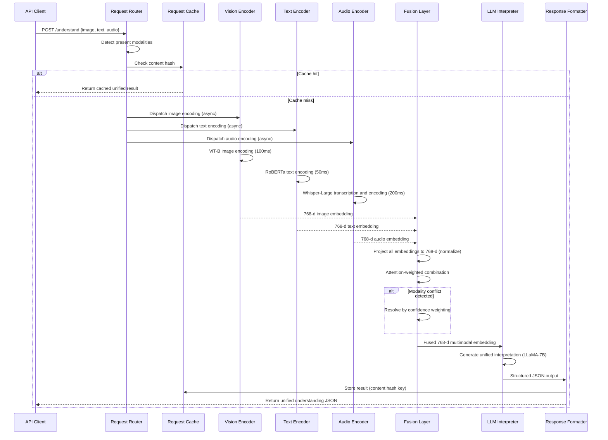

## Process Flow (Multi-modal Request to Unified Understanding)

**Key Decision Points:**
1. **Parallel Dispatch**: All three encoders run simultaneously (not sequentially) to minimize latency
2. **Cache by Content**: Hash of image+text+audio content as cache key for deduplication
3. **Missing Modality**: Zero-embedding substituted for absent modalities (graceful degradation)
4. **Conflict Resolution**: When modalities disagree, attention weights favor higher-confidence modality
5. **Fusion Level**: Mid-level fusion (after encoding, before interpretation) for best accuracy/latency trade-off

**Error Paths:**
- Audio encoder timeout (>400ms): return partial result (image+text only) immediately, deliver audio async
- GPU OOM: downscale image to 224x224 and retry
- LLM interpreter failure: return raw embeddings with similarity scores, no narrative

**Optimization Points:**
- Cache individual modality embeddings separately (reuse image embedding across calls with same image)
- Batch requests arriving within 50ms window (reduces GPU overhead)
- Quantize encoders to INT8 for 4x throughput at -1% accuracy
