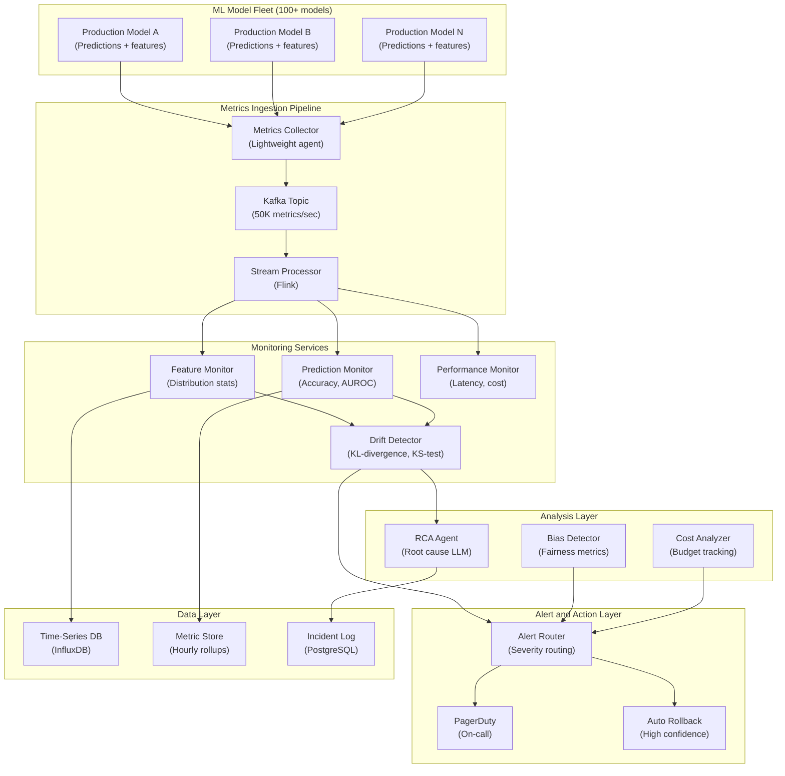

## System Architecture (Infrastructure and Deployment)

**Infrastructure Components:**
- **Ingestion**: Lightweight agents in each model pod, Kafka for 50K metrics/sec throughput
- **Monitoring**: Feature distribution, prediction accuracy, latency/cost monitors with Flink stream processing
- **Analysis**: LLM-based root cause analysis, fairness/bias detection, budget tracking
- **Action**: Tiered alerting (dashboard only, Slack, PagerDuty, auto-rollback) based on drift confidence
