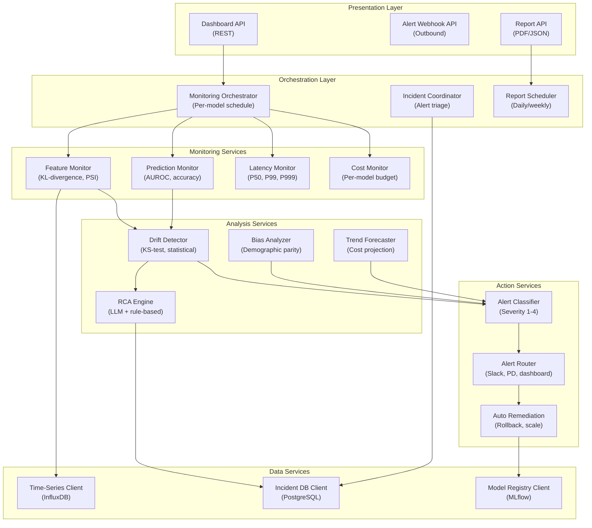

## Application Architecture (Components and Layers)

**Layer Breakdown:**
- **Presentation**: Dashboard, alert webhook, and report APIs
- **Orchestration**: Per-model monitoring schedule, incident triage, report scheduling
- **Monitoring Services**: Feature distribution, prediction accuracy, latency, and cost monitors
- **Analysis Services**: KS-test drift detection, LLM root cause analysis, bias detection, cost forecasting
- **Action Services**: Severity classification (1-4), tiered routing, automatic rollback
- **Data Services**: InfluxDB time-series, PostgreSQL incident log, MLflow model registry
